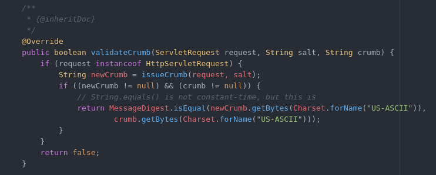
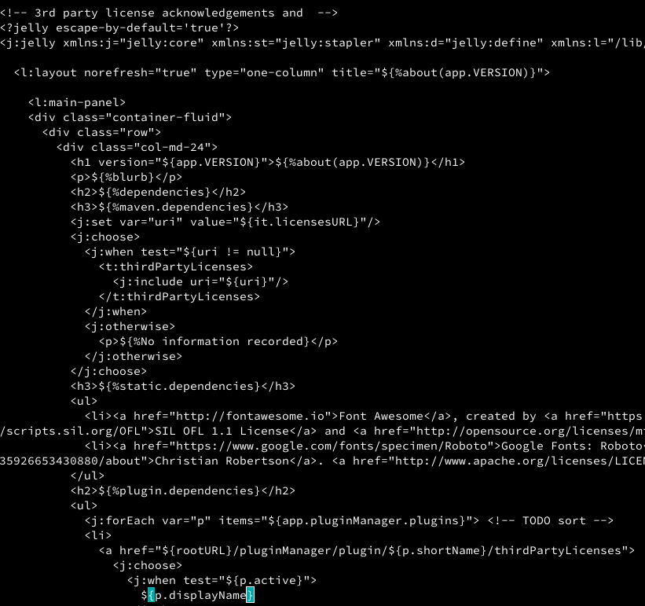

# Jenkins Code Analysis - Team JAX

# Code Review Strategy
No formal code review system was used, rather a direct link to the important areas of the github project was shared out and used a reference base to begin a focused effort.
The code review strategy used for this report will is a light weight ad hoc peer code review process in conjunction with a checklist strategy.
This checklist strategy was used to filter through the code to find where different security measures were actually being implemented, thus confirming what the documentation reported.  

# Manual Code Review
The code being reviewed related to CSRF vulnerabilities which related directly back to our mis-use cases and threat models.

## CSRF Code Review
During manual code review for CSRF, our main objective was to find where they did the CSRF token validation for jenkins. This code was found and is located [here](https://github.com/jenkinsci/jenkins/blob/master/core/src/main/java/hudson/security/csrf/DefaultCrumbIssuer.java). The code in question is below:



This code brings in the request and checks to see if the current CSRF token string matches the one from the request. If it does, return true, otherwise return false. If the callee returns false, the caller will raise an exception and the request to the server will be cancelled.

* See [CWE-352](https://cwe.mitre.org/data/definitions/352.html) Cross-Site Request Forgery (CSRF)

## XSS Code review
XSS prevention is an important part of any solid web app. If XSS prevention falls apart, many other attacks that were mitigated earlier are now null and void because XSS can work around them. Jenkins uses a plugin called "jelly" to do its XSS filtering in their templates. Below is a template that they use on their "About Us" page:



This filter variables coming into the template from either user or server side input, assuming 'jelly' is turned on at the top of the document.

* See [CWE-79](https://cwe.mitre.org/data/definitions/79.html): Improper Neutralization of Input During Web Page Generation ('Cross-site Scripting')


# Summary of Key Findings

## Jenkins.io
During a manual scan of the code and associated documentation, it was discovered that the existing documentation was out of date and needed a little touch up. In this case, the documentation made reference to a CSRF feature being disabled by default. This isn't entirely accurate however. This feature is only disabled by default in Jenkins v1.x and when upgrading to v2.x. If a use initially installed v2.x however, the feature is enabled by default.

### Contribution
* jenkins-infra/jenkins.io pull request [#1233](https://github.com/jenkins-infra/jenkins.io/pull/1233) was submitted on Nov 17, 2017
* The request was accepted and merged into the master branch on Nov 18th, 2017 after a suggested additional change was submitted
* A mention on the course project page has been made: [2017 Hall of Fame](https://robinagandhi.github.io/swa/pages/halloffame.html)
* The updated documentation including the above approved change can be found here:
    * https://jenkins.io/doc/book/system-administration/security/

## Jenkins.core
The jenkinsci/jenkins github project contains the core codebase.
[There's a lot more to the Jenkins project than just code.](https://github.com/jenkinsci/jenkins/blob/master/CONTRIBUTING.md)
The codebase for this project was cloned locally and the project built using maven. Many tests failed, which is to be expected due to specific environmental factors required for some of these cases to be successful.

A small maven script was written so that static code analysis could be run and uploaded to Sonar Cloud. This bypasses all the test runs and configures the sonar plugin to upload the report results to Sonar Cloud for further review and analysis.

```maven
mvn org.jacoco:jacoco-maven-plugin:prepare-agent package sonar:sonar \
    -DskipTests \
    -Dmaven.test.skip=true \
    -Dsonar.host.url=https://sonarcloud.io \
    -Dsonar.organization=larrysingleton-github \
    -Dsonar.login=[insert private sonar cloud token here] \
    -Dsonar.branch=master \
    -Dsonar.cfamily.build-wrapper-output.bypass=true
```

The full [Sonar Cloud Report](https://sonarcloud.io/dashboard?id=org.jenkins-ci.main%3Apom%3Amaster) of the core codebase shows 645 Bugs and 361 Vulnerabilities.


Further investigation into these vulnerabilities, shows that only 9 of them are critical,
however only 1 is related to a java file, the other 8 to javascript eval calls.


A single item of interest from a vulnerability perspective remains:


The issue is referenced as [squid:S2976](https://sonarcloud.io/organizations/larrysingleton-github/rules#rule_key=squid%3AS2976) and is contained in [FilePath.java.](https://github.com/jenkinsci/jenkins/blob/master/core/src/main/java/hudson/FilePath.java)
The critical issue is tagged as belonging to [owasp-a9](https://www.owasp.org/index.php/Top_10_2013-A9-Using_Components_with_Known_Vulnerabilities).

* See [CWE 937](https://cwe.mitre.org/data/definitions/937.html) CWE CATEGORY: OWASP Top Ten 2013 Category A9 - Using Components with Known Vulnerabilities
    * "This is an unusual category. CWE does not cover the limitations of human processes and procedures that cannot be described in terms of a specific technical weakness as resident in the code, architecture, or configuration of the software. Since "known vulnerabilities" can arise from any kind of weakness, it is not possible to map this OWASP category to other CWE entries, since it would effectively require mapping this category to ALL weaknesses."

### Contribution
After a full review of the vulnerability, it was decided a pull request could be made:
* jenkinsci/jenkins pull request [#3161](https://github.com/jenkinsci/jenkins/pull/3161) was submitted Nov 26, 2017
* Issue [JENKINS-48227](https://issues.jenkins-ci.org/browse/JENKINS-48227)

In this contribution, the vulnerability was addressed in the code base. To verify the fix, the code was once again uploaded to Sonar Cloud to ensure the vulnerability was no longer reported. A static method toPath() was added upon recommendation from the community, as well as removal of the vulnerability and introduction of a new API call to Files.createTempDirectory(). Finally, to ensure the code fix was valid, 2 new test cases were added. During this addition of Junit test cases, it was noticed that 2 cases were failing, which were also repaired.

## PMD Review

Additionally, a [PMD](https://cpluspluscrowe.github.io/SoftwareAssurance/pmd_scan.html) scan was run on Jenkins. This scan looked for issues relating to Sun Microsystems security recommendations (now Oracle recommendations).

One of the two primary issues was that arrays were stored directly in other objects. In other words, an array is essentially stored in some newly created objects. The second issues has to do with returning arrays directly. In both cases, the data referenced in the objects can be modified outside the object, and the changes will be reflected in the object. If this is not intended and accounted for, it can lead to bugs and/or security flaws.  

 - See [CWE-607](https://cwe.mitre.org/data/definitions/607.html): Public Static Final Field References Mutable Object
 - See [CWE-375](https://cwe.mitre.org/data/definitions/375.html): Returning a Mutable Object to an Untrusted Caller
