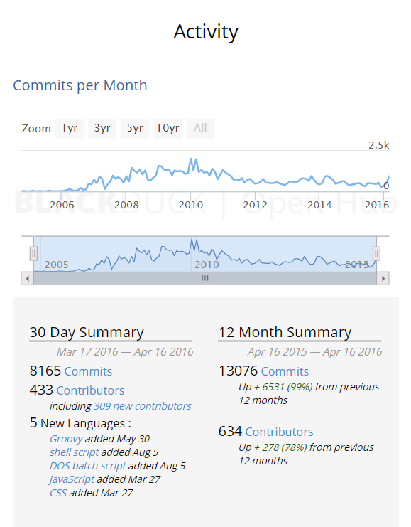
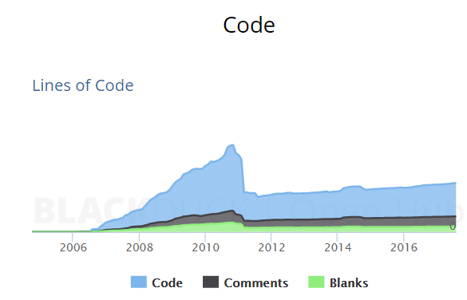
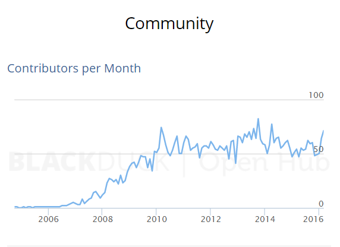
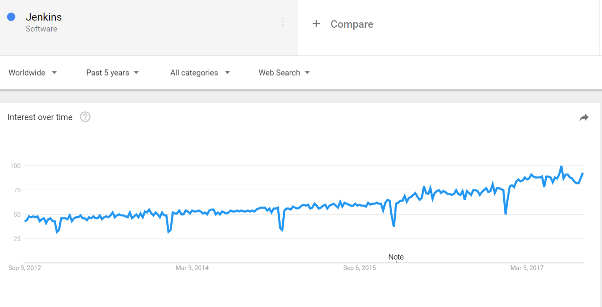
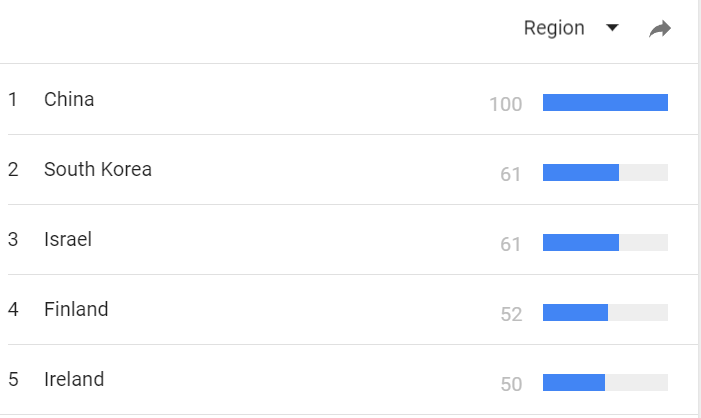
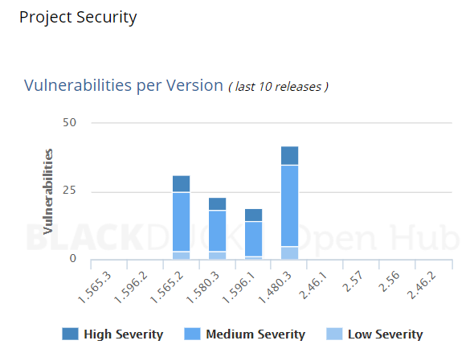

- [**Open source project description**](#--open-source-project-description--)
  * [What is it?](#what-is-it-)
  * [Activity](#activity)
  * [Use](#use)
  * [Popularity](#popularity)
  * [Languages used](#languages-used)
  * [Platform](#platform)
  * [Documentation sources](#documentation-sources)
  * [Discuss License](#discuss-license)
  * [Procedures for making contributions](#procedures-for-making-contributions)
  * [Contributor agreements](#contributor-agreements)
  * [Security related history](#security-related-history)
  * [Functional security requirements for the software](#functional-security-requirements-for-the-software)
  * [Motivation for selecting this project](#motivation-for-selecting-this-project)

<small><i><a href='http://ecotrust-canada.github.io/markdown-toc/'>Table of contents generated with markdown-toc</a></i></small>

# **Open source project description**
 
## What is it?
 Jenkins is a better way to test and deploy software.  It performs these tasks by automating much of the process.  This automation is setup via Jenkins helpful UIs that visualize building, testing, and deploying your software.  Upon setup, Jenkins serves as an invaluable quality control tool, allowing users to automatically monitor their repositories, build software, and run relevant tests.

 The impressive Jenkins website https://jenkins.io/index.html endorses open source, touting itself as the leading open source automation server, while tacitly equipped with hundreds of handy plugins to encourage a deftly build and deploy for any project.  More specifically, Jenkins highlights many of its core features like its continuous integration, easy installation, configuration, extensibility while also being distributed across many machines.  Such impressive features, its wide adoption, and openness to the open-source community highlighted Jenkins as an appropriate project for our group.

 Our group sought out greater detail on Jenkins from openhub https://www.openhub.net/p/jenkins and its GitHub site https://github.com/kohsuke/jenkins to ascertain insights on this innovative open source project.  GitHub further highlighted Jenkin's static code analysis features.  We're hopeful that we might adapt such static code analysis on Jenkins itself,  which seemed like a fun and original idea.  The openhub site mentioned the large number of outside contributions to Jenkins, lauding some 1300 plugins within the Jenkins library to supplement project builds, tests, logging, analysis, graphing, and notifications with your project needs.  

 Founded in 2004 by Kawaguchi while at the somewhat infamous Sun, the Hudson project was forked and within a few years, Jenkins was born. Humorously, the community around Oracle's Hudson project moved to work on Jenkins, though Kawaguchi was also the founder of Hudson, which I'm sure played into the 213 vs 13 vote to fork the project from Hudson.  That's some serious karma for Oracle, who sought to trademark Hudson and vainly insisted it was deployed exclusively on Oracle servers.

## Activity

Since its founding, Jenkins has skyrocketed into a leading provider for continuous integration.  

The project itself has near 100,000 commits by 2,000 contributors and over a million lines of code.  As one might expect, due to its beginnings from a Sun developer and Oracle's support, most of Jenkins is written in Java with plenty of JavaScript supporting its UI.  
* https://openhub.net/p/jenkins/commits/summary

You can see a peak in Jenkin's development in 2011 when it was officially released.  In coming years, the development pace has stabilized and continued.  In just the last thirty days, an incredible 433 contributors have added to Jenkins.  More surprisingly, 309 of those 433 developers were new contributors.  That statistic was incredibly influential in our decision to chose Jenkins, as Jenkins encourages new users to contribute to the overall project.   
* https://openhub.net/p/jenkins/analyses/latest/languages_summary

The number of commits, as well as the percentage growth of commits, within the last year shows a growing embracement of continuous integration by the developer community.  
* https://openhub.net/p/jenkins/contributors/summary

## Use

Companies that user Jenkins include eBay, Cloudera, GitHub, ITA software by Google, LinkedIn, NASA, Netflix, Sony, the UK Government, Yahoo, and many more.  Open source projects currently utilizing Jenkins include Djangos CMS, Apache, JBoss, Mozilla, SQLAlchemy, and Twitter4J.

## Popularity

Using Google Trends, we can see that Jenkins has continued to gain popularity over the last few years.

Regionally, its popularity has increased overseas with the US being Country #4 in searches including Jenkins.

 ## Languages used

The application itself has also grown in the last year, adding Groovy, shell script, DOS batch script, JavaScript, and CSS to its arsenal of tools. The top languages used by lines of code are Java, XML, JavaScript & CSS.
* https://openhub.net/p/jenkins/analyses/latest/languages_summary

 ## Platform

Jenkins largely runs on the JVM, so it is open platform and runs on MacOS, Windows, and Linux OS.
Running Jenkins requires either Java 8 or Docker.

## Documentation sources

The [Jenkins Documentation Home Page](https://jenkins.io/doc/) provides a great deal of easily accessible information, including a guided tour, a user handbook and plenty of resources and tutorials.

## Discuss License

The Jenkins core is under the [MIT license](https://opensource.org/licenses/MIT), so its software can be used publically or privately, as long as the copyright notice is included in all copies or substantial portions of the software.  I'm also assuming that the client must publically disclose that they've utilized Jenkins within their software project.

## Procedures for making contributions

The options for participating and making contributions to the Jenkins project are well defined at their [participate](https://jenkins.io/participate/) page. A beginner’s guide A guide for new contributors can be found at on their [wiki](https://wiki.jenkins.io/display/JENKINS/Beginners+Guide+to+Contributing) 

## Contributor agreements
As a contributor, "you activiely help improve Jenkins and plugins by contributing code, documentation, translations, or tests"
* https://jenkins.io/participate/

Committers must sign a contributor’s license agreement (CLA). This provides certain rights to contributors, such as the right to contribute, copyright ownership, and a patent grant. If a company is placing an employee on the project, the company must such a Corporate CLA.
	
## Security related history

And while the codebase is considered well established and mature, its history contains more than a few vulnerabilities.  Many of these vulnerabilities can be traced to its rapid development, huge codebase, and possibly superfluous plugins.  

* https://openhub.net/p/jenkins/security

## Functional security requirements for the software

Jenkins provides a [Standard Security Setup](https://wiki.jenkins.io/display/JENKINS/Standard+Security+Setup) to aid in project configuration. Additional project security concerns are kept in the [project board](https://github.com/cpluspluscrowe/SoftwareAssurance/projects/2).

## Motivation for selecting this project

* Project board: https://github.com/cpluspluscrowe/SoftwareAssurance/projects/2
* Jenkins forked: https://github.com/larrysingleton/jenkins
