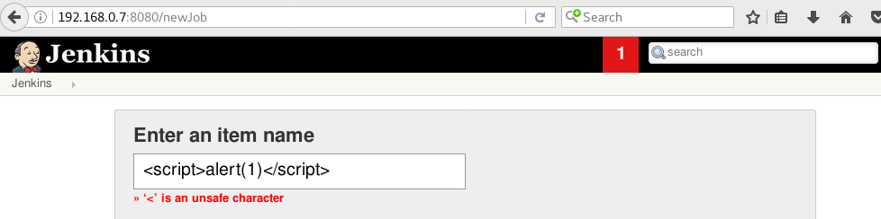
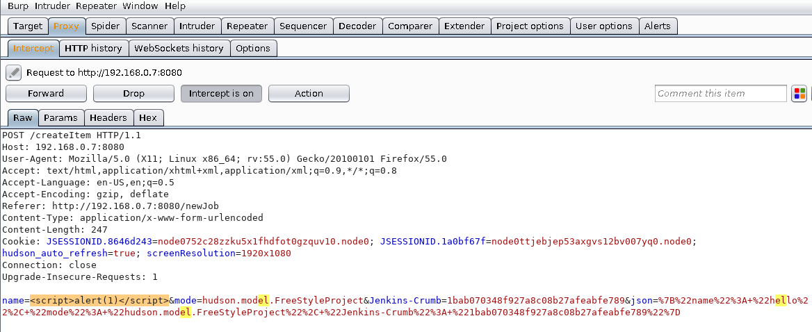
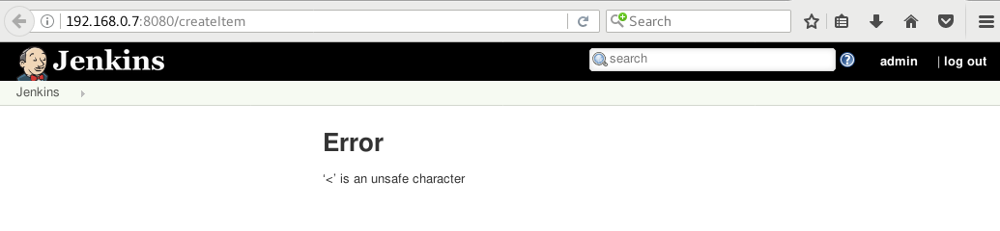
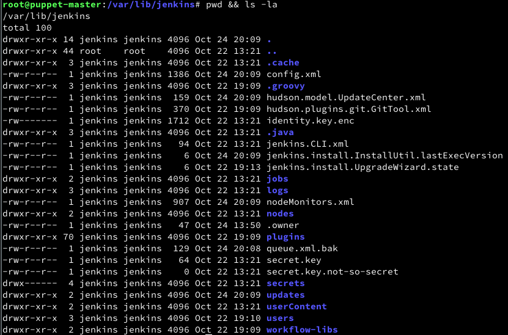

<!-- TABLE OF CONTENTS -->
<!------------------------------------------------------------------->
- [**Requirements for Software Security Engineering**](#--requirements-for-software-security-engineering--)
  * [Security Requirement Claim 1 and Claim 4](#security-requirement-claim-1-and-claim-4)
    + [Part 1](#part-1)
    + [Part 2](#part-2)
    + [Part 3](#part-3)
  * [Security Requirement Claim 2](#security-requirement-claim-2)
    + [Part 1](#part-1-1)
    + [Part 2](#part-2-1)
    + [Part 3](#part-3-1)
    + [Part 4](#part-4)
  * [Security Requirement Claim 3](#security-requirement-claim-3)
    + [Part 1](#part-1-2)
    + [Part 2](#part-2-2)
    + [Part 3](#part-3-2)
  * [Security Requirement Claim 5](#security-requirement-claim-5)
    + [Part 1](#part-1-3)
    + [Part 2](#part-2-3)
    + [Part 3](#part-3-3)

<small><i><a href='http://ecotrust-canada.github.io/markdown-toc/'>Table of contents generated with markdown-toc</a></i></small>
<!------------------------------------------------------------------->

# **Requirements for Software Security Engineering**

Link to Team Lucidchart mis-use cases updated with feedback from assignment:  
* [JAX misuse cases](https://www.lucidchart.com/documents/edit/fd7c6a2d-548b-40f9-8d09-45d134f69ed8/0)

<!------------------------------------------------------------------->
## Security Requirement Claim 1 and Claim 4
* Larry S and James P

### Part 1
> Assurance Claim

* Claim 1: Jenkins provides an acceptable level of protection from Cross Site Request Forgery (CSRF) attacks
* Claim 2: Jenkins adequately filters user input to prevent reflected XSS

### Part 2
> Review OSS project documentation for alignment of security requirements with advertised features

> Review OSS project documentation for security related configuration and installation issues. Summarize your observations.

Jenkins has very little documentation on CSRF or XSS, however there are a few here and there, one on XSS security issues which was reported via online issue tracking here:[JENKINS-6287](https://issues.jenkins-ci.org/browse/JENKINS-6287).

The initial documentation page on [Protecting users of Jenkins from other threats](https://jenkins.io/doc/book/system-administration/security/) indicates there "are additional subsystems in Jenkins that protect Jenkins and users of Jenkins from indirect attacks". It then immediately specifies that all these features are disabled by default. A direct link to [CSRF Protection](https://wiki.jenkins.io/display/JENKINS/CSRF+Protection) is provided which goes into further detail with links to owasp's definition of [CSRF](https://www.owasp.org/index.php/Cross-Site_Request_Forgery_(CSRF)) for further education on the matter. Additionally, a link to Kaspersky is provided to describe a common way to exploit CSRF using [spear phishing](https://usa.kaspersky.com/resource-center/definitions/spear-phishing).

Since this feature is documented as disabled by default, some instructions are provided to inform the user on how to enable this security feature via a simple menu setting. Interestingly however, it is also noted that this security feature is only disabled  by default in 1.x versions of Jenkins, and is enabled by default in 2.x versions. Unfortunately for those users who are upgrading from 1.x to 2.x, the CSRF protection setting still does not get set by default during the conversion.

For users of the 1.x version of Jenkins, a groovy script is provided to mitigate the security risk, which is provided here for completeness:

**csrf.groovy**

    import hudson.security.csrf.DefaultCrumbIssuer
    import jenkins.model.Jenkins

    def instance = Jenkins.instance
    instance.setCrumbIssuer(new DefaultCrumbIssuer(true))
    instance.save()

A few "gotchas" are listed here as well, one for nginx detailed in issue [JENKINS-23793](https://issues.jenkins-ci.org/browse/JENKINS-23793), and another referencing the Jenkins [REST API](https://wiki.jenkins.io/display/JENKINS/Remote+access+API) which includes additional CSRF protection measures by adding a CSRF protection token in the request header of the message posted.

As for XSS, the only link we could find relating to protection was [here](https://wiki.jenkins.io/display/JENKINS/Jelly+and+XSS+prevention). This is talking about writing plugins for Jenkins and is apparently using Jelly to do their escaping. We could not find any confirmation that Jelly is what is being used in their application for escaping also. Regardless, we ran manual tests and came up with proof that javascript filtering is happening, see below.

This is what happens when a user tries to send javascript in the first place to the naming system. Obviously jenkins can not just rely on front end javascript to stop the attack, so below is us getting around the javascript.

Once you submit this data, hopefully jenkins filters the data appropriately.

Jenkins actually one ups the process and does not just filter it, it filters it and then completely denies the submission. Well played Jenkins. Their filtering engine simply needs to be used on the rest of their input and they will be pretty solid on denying XSS attacks.

### Part 3
> Summarize your observations

Jenkins provides mechanisms for adequately dealing with both CSRF and XSS. From a documentation perspective, there is a little room for improvement there. One page indicates CSRF is disabled by default, and another says it is enabled by default for versions 2.x, both in the same breadcrumb. XSS isn't any better, leaving a large hole and a serious lack of value added documentation on this topic.

An interesting find shows that the Jenkins community is following best practices by releasing security vulnerabilities. A [Jenkins Security Advisory](https://jenkins.io/security/advisory/2015-12-09/) published on 2015-12-09 mentions vulnerabilities issues with both CSRF and XSS.

<!------------------------------------------------------------------->
## Security Requirement Claim 2
 * Chad C

### Part 1
> Assurance Claim

* Jenkins software provides sufficient support to adequately isolate the master node from malicious code or file access.

### Part 2
> Review OSS project documentation for alignment of security requirements with advertised features.

Jenkins nodes behave as a single distributed process.  As a consequence, the slave and master both perform similar and widely-varying processes, e.g. accessing files and triggering jobs.  This works within smaller projects.  Larger models require a more administration, i.e. a separation of trust. In these cases, the master is controlled by an administrator and slaves are designated to teams.  This designates the master as more trustworthy than any slave.  In Jenkins, this is a feature that can be enabled.

There are multiple reasons for enabling this feature. Consider the scenario where sensitive information needs is running on the master.  Without such a separation, malicious slaves might access this information. Once this setting is enabled, the slave will be unable to execute code on the master node.

If enabled, when a slave -> master request occurs, unless the command has been explicitly classified as intended for slave -> use, Jenkins will err on the side of caution and refuses to execute the command.

Jenkins even throws security exceptions to prevent undesirable node/information access.   

    java.lang.SecurityException: slave may not create file on the master
    See http://jenkins-ci.org/security-144 for more details

    java.lang.SecurityException: Sending org.jenkinsci.plugins.gitclient.CliGitAPIImpl$GetPrivateKeys from slave to master is prohibited.
    See http://jenkins-ci.org/security-144 for more details

As of version 1.587 Jenkins has added an optional security wall between the master and slaves.  Unfortunately, the subsystem is turned off by default (for backward compatibility).  Fortunately, there are a few ways to enable this setting:

* web UI at http://jenkins/configureSecurity

* Through file system, create or edit the file $JENKINS_HOME/secrets/slave-to-master-security-kill-switch so that it contains false

* Using a Groovy Hook Script and doing something like this:

        import jenkins.security.s2m.AdminWhitelistRule
        import jenkins.model.Jenkins
        Jenkins.instance.getInjector().getInstance(AdminWhitelistRule.class).setMasterKillSwitch(false)

The OSS documentation mentioned File access rules.  Jenkins lets user specify file access rules.  These rules are specified via tuples for read, write, creating directories/files, deleting directories/files, and retrieving node stats. These rules are then applied to files.  Regular expressions are used to map each rule to certain files.  

Slaves should not have access to the master's files.  Otherwise, the slave might access and even alter sensitive/imperative data on the mater.  Instead, the master should work on files of a slave.  

Slave -> master code execution is also discouraged, since it opens up possibilities of slave -> master exploitation.  Unfortunately, by default Jenkins allows slave -> master execution. Extra caution must be taken in such cases, because this configuration makes slave -> master exploitations more likely.  If a malicious slave controls a Java serialization payload, then when this code is deserialized on the master each field will be controlled by the slave, i.e. the slave is now changing code within the master node.  A vulnerability could also appear if the slave is allowed to execute certain portions of code on the mater.  In the below code a slave could supply any code to the master's function and therefore read any file on the master:

	// UNSAFE
	class SomeCodeThatRunsOnSlave {
	    void readBackSomeFileFromMaster() {
	        final String path = "...";
	        channel.call(new SlaveToMasterCallable<String,IOException>() {
	            public String call() {
	                return FileUtils.readFileToString(new File(path));
	            }
	        });
	    }
	}
Callable that delegates execution to deserialized object is dangerous and needs to be carefully examined, because a malicious slave can designate unintended Runnable object:

	// UNSAFE
	class MyCallable extends SlaveToMasterCallable<Void> {
	    Runnable r;
	    public Void call() {
	        r.run();
	        return null;
	    }
	}
To avoid such hassles, one may rewrite code to not call back to a master from a slave. Instead, supply the slave with all the data it needs so no callbacks are necessary. This hierarchy of calling from master -> slave may not always be possible/practical, but it's much more secure.

### Part 3
> Summarize your observations

Slave -> master code access/execution provides many opportunities for exploitation. Security must be set to prevent any slave -> master file access or code execution. It is best to give the slave no permissions on the master.

Jenkins provides a security feature which prevents slave -> master file access/code execution.  Yet, this feature is disabled by default for backward compatibility.  This feature is also disabled because it largely hinders usability on smaller/one-node projects.

Jenkins provides node-to-node permissions at the file granularity.  This can be used to secure sensitive information and prevent malicious local file execution.

### Part 4
 > Review OSS project documentation for security related configuration and installation issues. Summarize your observations.

As a part of configuration, Jenkins lets user specify file access rules.  These rules are specified via tuples for read, write, creating directories/files, deleting directories/files, and retrieving node stats. These rules are then applied to files.  Regular expressions are used to map each rule to certain files.

There are many possibilities of exploitation due to file access rules.  If files are later added/renamed and file access rules are not kept up-to-date, then malicious users may gain access/control over these files.  Also, if the user is unfamiliar with regex expressions, they might misconfigure file access rules.  Each of these cases can aid malicious users in exploiting the system.

Jenkins allows for command whitelisting to guarantee only certain commands are run on its nodes.  One can also specify currently rejected commands.  Whitelisting still requires a lot of verification that such a command it not exploitable by malicious slaves.  This requires careful analysis of what source code is being run by such commands.  One must also take into account all possible serialization fields (which the slave controls in slave -> master execution).  

Plugins also need to be configured for security.  Plugins also need to classify their methods and whether they are meant to be run on a master or on a slave.  For this purpose, the remote library has added the interfaces to control master method access.  There is also an extendable class to guarantee only master -> slave execution (called MasterToSlaveCallable).  The FileCallable is similar and only enables master -> slave file access.  These classes and wrappers help prevent the mis-use of accessible master-code by malicious slaves.

<!------------------------------------------------------------------->
## Security Requirement Claim 3
* Dan R

### Part 1
> Assurance Claim

* Jenkins authentication mechanisms are sufficient to prevent malicious users from gaining access to the system

### Part 2
> Review OSS project documentation for alignment of security requirements with advertised features.

> Review OSS project documentation for security related configuration and installation issues. 

According to the [Standard Security Setup](https://wiki.jenkins.io/display/JENKINS/Standard+Security+Setup) page, Jenkins will allow anyone to run anything as Jenkins by default, which does not fulfil the security requirement. This can be fixed by establishing an authentication mechanism.

Jenkins supports two primary authentication models. For large installations, a corporate service like LDAP is recommended. For smaller installations, Jenkins can provide its own user database.  While not supported in the base installation, some plugins and configurations allow additional authentication features, such as authentication via github, or 2FA.

Jenkins provides a very compact interface to select an authentication mechanism and select permissions.

Additional configuration steps will depend on the selected authentication mechanism.

There does not appear to be any major, unresolved issues with the default authentication mechanisms. There are some [authentication issues](https://issues.jenkins-ci.org/browse/JENKINS-21304?jql=status%20%3D%20Open%20AND%20text%20~%20%22authentication%22) related to plugins and custom instalations, but nothing affecting typical installs. 

### Part 3
> Summarize your observations

Jenkins has many authentication and authorization features that can prevent unauthorized access to the system. These features are sufficient to prevent unauthorized access via traditional attacks against login forms. To gain access, attackers would need to obtain legitimate credentials or obtain a shell with code execution system on the host system.

<!------------------------------------------------------------------->
## Security Requirement Claim 5

* all team members

### Part 1
> Assurance Claim

* Jenkins adequately secures files to prevent unauthorized file accesses

### Part 2
> Review OSS project documentation for alignment of security requirements with advertised features.
> Review OSS project documentation for security related configuration and installation issues. Summarize your observations.

Most of this setup needs to be done by default by the setup script, so what better a way of checking if that happens than by going to their install documentation located [here](https://jenkins.io/doc/book/installing/), doing it word for word, and then checking the file permissions. In doing so, you end up with the root jenkins directory looking like below.

Obviously not the best, we would personally turn off the world permissions entirely, but eh, good enough. No one can go through and edit files they should not be able to. My only problem with it is that the "secret.key", which is used to log in as admin, is world readable. That seems silly to me, but to be fair, that is supposed to be used to login as admin for the first time and then other login methods should be setup by an administrator.

As for logging access logs, Jenkins does not appear to do so by default, which in my mind is a huge failure in regards to the software. It should have some way of tracking what people have been doing on the server without requiring a system admin to set it up in the first place. Things like creating users, builds being created, and build history should be logged in a place separate from the rest of the system. That being said, it does have a way of enabling logging for many different aspects of the application located [here](https://wiki.jenkins.io/display/JENKINS/Logging). This would allow you to use loggers currently in place or create custom loggers to be able to keep track of almost anything. Quite nifty and a good add.

### Part 3
> Summarize your observations

Overall, we think Jenkins did a nice job with their file security and logging. By default they are lacking default logging and setup can be a bit reliant on a good administrator not messing things up for authentication, but it really could be worse. we would score them a 8/10 in this section simply because they need a bit of polishing, but it is already really good.
