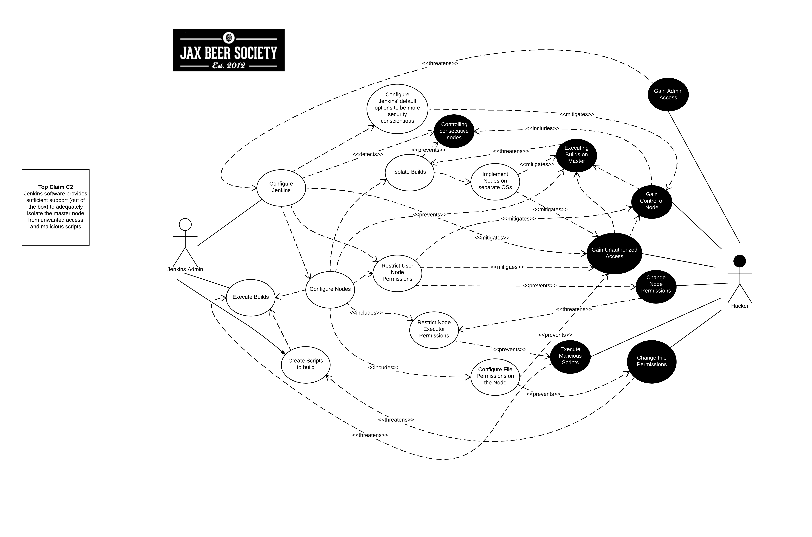
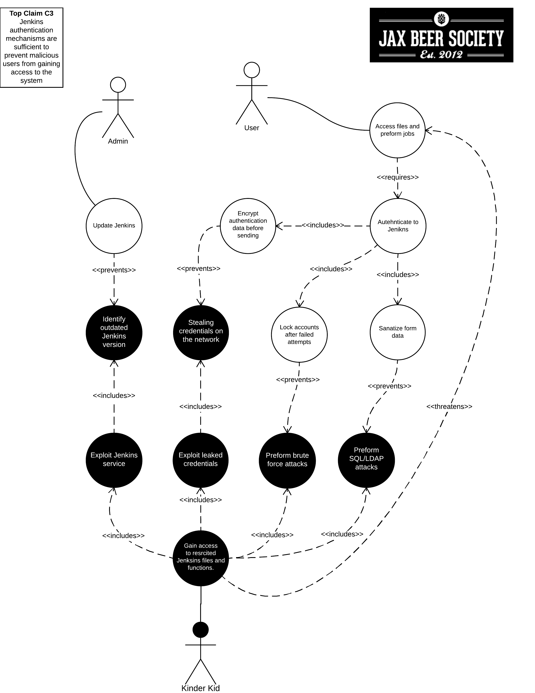
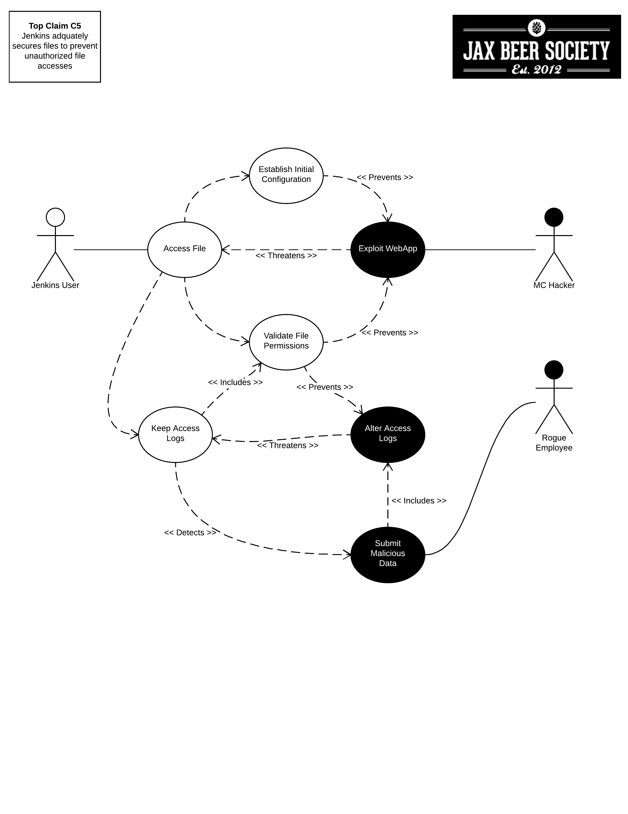

- [- **Requirements for Software Security Engineering**](#----requirements-for-software-security-engineering--)
  * [Security Requirement Claim 1](#security-requirement-claim-1)
      - [(Larry Singleton)](#-larry-singleton-)
  * [Security Requirement Claim 2](#security-requirement-claim-2)
      - [(Chad Crowe)](#-chad-crowe-)
  * [Security Requirement Claim 3](#security-requirement-claim-3)
      - [(Dan R)](#-dan-r-)
  * [Security Requirement Claim 4](#security-requirement-claim-4)
      - [(James P)](#-james-p-)
  * [Security Requirement Claim 5](#security-requirement-claim-5)

<small><i><a href='http://ecotrust-canada.github.io/markdown-toc/'>Table of contents generated with markdown-toc</a></i></small>

# - **Requirements for Software Security Engineering**

## Security Requirement Claim 1

#### (Larry Singleton)

Part 1: Assurance Claim:

Jenkins provides an acceptable level of protection from Cross Site Request Forgery (CSRF) attacks 

Part 2: Describe the security requirements for the project captured using mis-use case diagrams. 

Part 3: Review OSS project documentation for alignment of security requirements with advertised features. 

Part 4: Summarize your observations

Part 5: Review OSS project documentation for security related configuration and installation issues. Summarize your observations.

Lucidchart link to mis-use case:  [Mise-use case link](https://www.lucidchart.com/documents/edit/fd7c6a2d-548b-40f9-8d09-45d134f69ed8/0)

## Security Requirement Claim 2

#### (Chad Crowe)

Part 1: Assurance Claim:

Jenkins software provides sufficient support (out of the box) to adequately isolate the master node from unwanted access and malicious scripts 

Part 2: Describe the security requirements for the project captured using mis-use case diagrams. 

 

Part 3: Review OSS project documentation for alignment of security requirements with advertised features.

Jenkin's nodes behave as a single distributed process.  As a consequence, the slave and master both perform similar and widely-varying processes, e.g. accessing files and triggering jobs.  This works within smaller projects.  Larger models require a more administration, i.e. a separation of trust. In these cases, the master is controlled by an administrator and slaves are designted to teams.  This designates the master as more trustworthy than any slave.

There are multiple reasons for enabling this feature.  Consider the scenario where sensative information needs is running on the master.  Without such a separation, malicious slaves might access this information. 

Jenkins even throws security exceptions to prevent undesireable node/information access.   

    java.lang.SecurityException: slave may not create file on the master
    See http://jenkins-ci.org/security-144 for more details

    java.lang.SecurityException: Sending org.jenkinsci.plugins.gitclient.CliGitAPIImpl$GetPrivateKeys from slave to master is prohibited.
    See http://jenkins-ci.org/security-144 for more details

As of version 1.587 Jenkins has added an optional security wall between the master and slaves.  Unfortunately, the subsystem is turned off by default (for backward compatibility).  

    
There are three ways to enable this security setting.  

* web UI at http://jenkins/configureSecurity

* Through file system, create or edit the file $JENKINS_HOME/secrets/slave-to-master-security-kill-switch so that it contains false

* Using a Groovy Hook Script and doing something like this:

        import jenkins.security.s2m.AdminWhitelistRule
        import jenkins.model.Jenkins
        Jenkins.instance.getInjector().getInstance(AdminWhitelistRule.class).setMasterKillSwitch(false)
    
File access rules
File access request from slaves is tested against the rules you specify. Each rule is a tuple that consists of:
allow/deny: if the following two parameters match the current request being considered, an "allow" entry would allow the request to be carried out and a "deny" entry would deny the request to be rejected, regardless of what later rules might say.
operation: the type of the operation requested. The following 6 values exist. You can also list them separating with ',' or use "all" to indicate a match to all operations:
read: read file content or list directory entries
write: write file content
mkdirs: create a new directory
create: create a file in an existing directory
delete: delete a file or directory
stat: read metadata of a file/directory, such as timestamp, length, file access modes.
file path: regular expression that specifies file paths that matches this rule. In addition to the base regexp syntax, it supports the following tokens:
<JENKINS_HOME> can be used as a prefix to match your $JENKINS_HOME directory
<BUILDDIR> can be used as a prefix to match your build record directory, such as /var/lib/jenkins/job/foo/builds/2014-10-17_12-34-56
<BUILDID> matches the timestamp-formatted build IDs, like 2014-10-17_12-34-56.
The rules are ordered, and applied in that order. The earliest match wins. So for example, the following rules allow access to $JENKINS_HOME except its secrets folders:

When marking Callable for slave → master, a care has to be taken to ensure that the implementation is not exploitable by malicious slaves.
A malicious slave controls the Java serialization payload, so when your Callable gets deserialized on the master, all the serialized fields are controlled by the slave.
A slave does not control class definitions on the master, so you can trust all the classes and methods to behave as it is written. It is not possible for a malicious slave to change the code executed on the master.

For example, the following SlaveToMasterCallable is exploitable. Callable itself is not public, but a malicious slave can send in arbitrary path, so it can be used to read any file on the master:

	// UNSAFE
	class SomeCodeThatRunsOnSlave {
	    void readBackSomeFileFromMaster() {
	        final String path = "...";
	        channel.call(new SlaveToMasterCallable<String,IOException>() {
	            public String call() {
	                return FileUtils.readFileToString(new File(path));
	            }
	        });
	    }
	}
Callable that delegates execution to deserialized object is dangerous and needs to be carefully examined, because a malicious slave can designate unintended Runnable object:

	// UNSAFE
	class MyCallable extends SlaveToMasterCallable<Void> {
	    Runnable r;
	    public Void call() {
	        r.run();
	        return null;
	    }
	}
To avoid this hassle entirely, consider rewriting your code not to call back to a master from a slave. Instead, when a master first sends a command to a slave, you can carry all the data you'll need with you. This may not be always possible or practical, but it's a lot easier to secure.

whitelisting commands: Currently whitelisted commands: See above for what this field means.
Currently rejected commands: This section lists unclassified commands that Jenkins has actually rejected. You can check boxes and submit them to have Jenkins write them into the "currently whitelisted commands" section. Be careful when you do this, though. See the command whitelisting discussion above for the implications.
File access rules: See above for what this field means.

Whitelisting a command requires not only verifying that the command is intended to be used in this direction, but also that the command implementation is not exploitable by malicious slaves. This requires careful analysis of the source code, taking such things into account as all possible serializable fields.

Part 4: Summarize your observations

To avoid getting affected by file access rules, have the master work on files of a slave, instead of the other way around.

So when a slave requests a master to execute a command and if it is not classified explicitly as intended for slave → master, Jenkins will err on the side of caution and refuses to execute the command.

Part 5: Review OSS project documentation for security related configuration and installation issues. Summarize your observations.

plugin issues:

For the access control to work without requiring manual intervention by users, plugins need to classify their Callable and FileCallable objects whether they are meant to be run on a master or on a slave.
For this purpose, the remoting library has added the RoleSensitive interface that has a new checkRoles() method. Callable, FileCallable, and other similar interfaces now extend from this interface. So if you are directly implementing Callable, you will get an error saying that you have unimplemented abstract methods.
The easiest way to fix this is by extending from MasterToSlaveCallable, to indicate that your Callable is only meant to be sent from a master to a slave, or SlaveToMasterCallable, to indicate that your Callable is meant to be sent from a slave to a master. Note that SlaveToMasterCallable can still be executed on a slave, as slaves do not perform this access control check. FileCallable similarly has MasterToSlaveFileCallable and SlaveToMasterFileCallable.

Lucidchart link to mis-use case:  [Mise-use case link](https://www.lucidchart.com/documents/edit/fd7c6a2d-548b-40f9-8d09-45d134f69ed8/1)

## Security Requirement Claim 3

#### (Dan R)

Part 1: Assurance Claim:

Jenkins authentication mechanisms are sufficient to prevent malicious users from gaining access to the system

Part 2: Describe the security requirements for the project captured using mis-use case diagrams. 

 

Part 3: Review OSS project documentation for alignment of security requirements with advertised features. 

Part 4: Summarize your observations

Part 5: Review OSS project documentation for security related configuration and installation issues. Summarize your observations.

Lucidchart link to mis-use case:  [Mise-use case link](https://www.lucidchart.com/documents/edit/fd7c6a2d-548b-40f9-8d09-45d134f69ed8/2)

## Security Requirement Claim 4

#### (James P)

Part 1: Assurance Claim:

Jenkins adquately filters user input to prevent reflected XSS 

Part 2: Describe the security requirements for the project captured using mis-use case diagrams. 

Part 3: Review OSS project documentation for alignment of security requirements with advertised features. 

Part 4: Summarize your observations

Part 5: Review OSS project documentation for security related configuration and installation issues. Summarize your observations.

Lucidchart link to mis-use case:  [Mise-use case link](https://www.lucidchart.com/documents/edit/fd7c6a2d-548b-40f9-8d09-45d134f69ed8/0)

## Security Requirement Claim 5

#### (all)

Part 1: Assurance Claim:

Jenkins adquately secures files to prevent unauthorized file accesses

Part 2: Describe the security requirements for the project captured using mis-use case diagrams. 

 

Part 3: Review OSS project documentation for alignment of security requirements with advertised features. 

Part 4: Summarize your observations

Part 5: Review OSS project documentation for security related configuration and installation issues. Summarize your observations.

Lucidchart link to mis-use case:  [Mise-use case link](https://www.lucidchart.com/documents/edit/fd7c6a2d-548b-40f9-8d09-45d134f69ed8/3)

