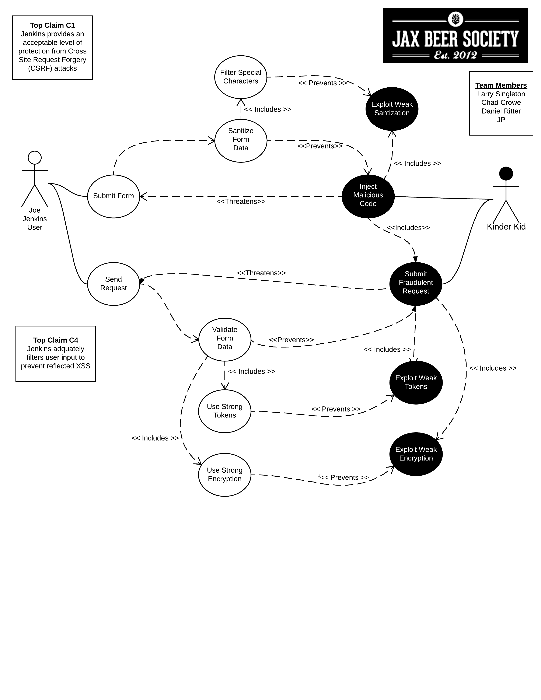
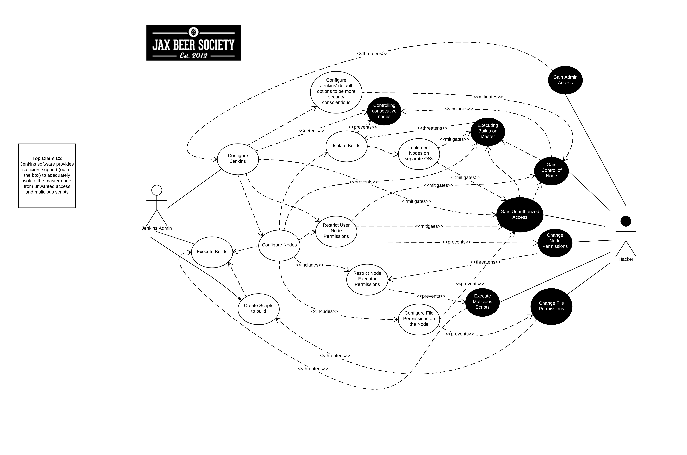
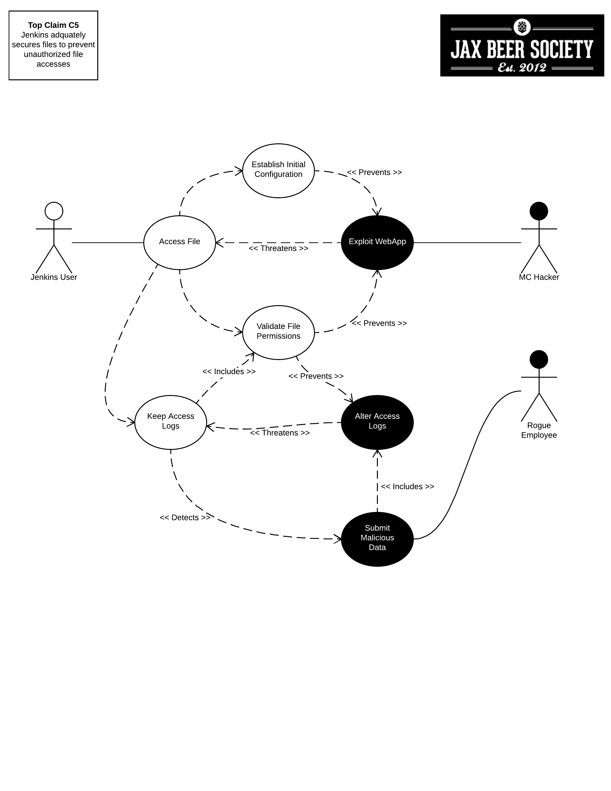

- [- **Requirements for Software Security Engineering**](#----requirements-for-software-security-engineering--)
  * [Security Requirement Claim 1](#security-requirement-claim-1)
      - [(Larry Singleton)](#-larry-singleton-)
  * [Security Requirement Claim 2](#security-requirement-claim-2)
      - [(Chad Crowe)](#-chad-crowe-)
  * [Security Requirement Claim 3](#security-requirement-claim-3)
      - [(Dan R)](#-dan-r-)
  * [Security Requirement Claim 4](#security-requirement-claim-4)
      - [(James P)](#-james-p-)
  * [Security Requirement Claim 5](#security-requirement-claim-5)

<small><i><a href='http://ecotrust-canada.github.io/markdown-toc/'>Table of contents generated with markdown-toc</a></i></small>

# - **Requirements for Software Security Engineering**

## Security Requirement Claim 1

#### (Larry Singleton)

Part 1: Assurance Claim:

Jenkins provides an acceptable level of protection from Cross Site Request Forgery (CSRF) attacks 

Part 2: Describe the security requirements for the project captured using mis-use case diagrams. 

Part 3: Review OSS project documentation for alignment of security requirements with advertised features. 

Part 4: Summarize your observations

Part 5: Review OSS project documentation for security related configuration and installation issues. Summarize your observations.

Lucidchart link to mis-use case:  [Mise-use case link](https://www.lucidchart.com/documents/edit/fd7c6a2d-548b-40f9-8d09-45d134f69ed8/0)

## Security Requirement Claim 2

#### (Chad Crowe)

Part 1: Assurance Claim:

Jenkins software provides sufficient support (out of the box) to adequately isolate the master node from unwanted access and malicious scripts 

Part 2: Describe the security requirements for the project captured using mis-use case diagrams. 

 

Part 3: Review OSS project documentation for alignment of security requirements with advertised features. 

Part 4: Summarize your observations

Part 5: Review OSS project documentation for security related configuration and installation issues. Summarize your observations.

Lucidchart link to mis-use case:  [Mise-use case link](https://www.lucidchart.com/documents/edit/fd7c6a2d-548b-40f9-8d09-45d134f69ed8/1)

## Security Requirement Claim 3

#### (Dan R)

Part 1: Assurance Claim:

Jenkins authentication mechanisms are sufficient to prevent malicious users from gaining access to the system

Part 2: Describe the security requirements for the project captured using mis-use case diagrams. 

 

Part 3: Review OSS project documentation for alignment of security requirements with advertised features. 

Part 4: Summarize your observations

Part 5: Review OSS project documentation for security related configuration and installation issues. Summarize your observations.

Lucidchart link to mis-use case:  [Mise-use case link](https://www.lucidchart.com/documents/edit/fd7c6a2d-548b-40f9-8d09-45d134f69ed8/2)

## Security Requirement Claim 4

#### (James P)

Part 1: Assurance Claim:

Jenkins adquately filters user input to prevent reflected XSS 

Part 2: Describe the security requirements for the project captured using mis-use case diagrams. 

Part 3: Review OSS project documentation for alignment of security requirements with advertised features. 

Part 4: Summarize your observations

Part 5: Review OSS project documentation for security related configuration and installation issues. Summarize your observations.

Lucidchart link to mis-use case:  [Mise-use case link](https://www.lucidchart.com/documents/edit/fd7c6a2d-548b-40f9-8d09-45d134f69ed8/0)

## Security Requirement Claim 5

#### (all)

Part 1: Assurance Claim:

Jenkins adquately secures files to prevent unauthorized file accesses

Part 2: Describe the security requirements for the project captured using mis-use case diagrams. 

 

Part 3: Review OSS project documentation for alignment of security requirements with advertised features. 

Part 4: Summarize your observations

Part 5: Review OSS project documentation for security related configuration and installation issues. Summarize your observations.

Lucidchart link to mis-use case:  [Mise-use case link](https://www.lucidchart.com/documents/edit/fd7c6a2d-548b-40f9-8d09-45d134f69ed8/3)

